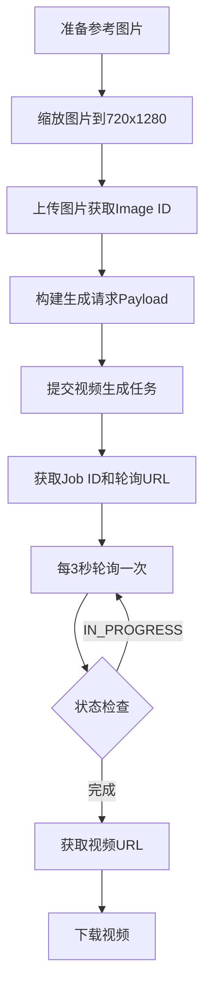

# Adobe Firefly 图生视频 API 完整文档

> 基于HAR分析和实际测试完成 | 最后更新: 2026-01-29

---

## 📋 目录

1. [认证方式](#认证方式)
2. [API端点](#api端点)
3. [完整流程](#完整流程)
4. [接口详解](#接口详解)
5. [代码示例](#代码示例)
6. [常见问题](#常见问题)

---

## 🔐 认证方式

### 获取Access Token

Adobe Firefly API使用**Bearer Token**认证,需要从浏览器获取:

1. 访问 `https://firefly.adobe.com` 并登录
2. 打开开发者工具 (F12) → Network 标签
3. 生成任意视频
4. 找到 `firefly-3p.ff.adobe.io` 请求
5. 复制请求头中的 `Authorization: Bearer {token}`

### Token特性

- **有效期**: 24小时
- **格式**: JWT (JSON Web Token)
- **范围**: `firefly_api, openai, creative_production` 等

---

## 🌐 API端点

### 基础URL

```
https://firefly-3p.ff.adobe.io
```

### 三个核心接口

| 接口 | 方法 | 端点 | 用途 |
|------|------|------|------|
| 图片上传 | POST | `/v2/storage/image` | 上传参考图片 |
| 视频生成 | POST | `/v2/3p-videos/generate-async` | 提交视频生成任务 |
| 结果轮询 | GET | `https://bks-epo8522.adobe.io/v2/jobs/result/{job_id}` | 查询生成进度 |

---

## 🔄 完整流程



**时间估算**: 
- 图片上传: 1-5秒
- 视频生成: 2-5分钟
- 总计: 约3-6分钟

---

## 📡 接口详解

### 1. 图片上传

#### 请求

```http
POST https://firefly-3p.ff.adobe.io/v2/storage/image
Content-Type: image/png
Authorization: Bearer {YOUR_TOKEN}
X-Api-Key: clio-playground-web

{图片二进制数据}
```

#### 响应

```json
{
  "images": [
    {
      "id": "967f0214-679b-4ef6-9a49-9cda0c1e51e9"
    }
  ]
}
```

#### 重要说明

- ✅ **必须缩放图片到标准尺寸** (720x1280 或 1280x720)
- ✅ 支持PNG/JPEG格式
- ✅ 建议文件大小 < 5MB

---

### 2. 视频生成

#### 请求

```http
POST https://firefly-3p.ff.adobe.io/v2/3p-videos/generate-async
Content-Type: application/json
Authorization: Bearer {YOUR_TOKEN}
X-Api-Key: clio-playground-web
```

#### Payload结构

```json
{
  "n": 1,
  "seeds": [822392],
  "modelId": "sora",
  "modelVersion": "sora-2",
  
  "size": {
    "width": 720,
    "height": 1280
  },
  
  "duration": 12,
  "fps": 24,
  
  "prompt": "{...JSON字符串...}",
  
  "generationMetadata": {
    "module": "text2video"
  },
  
  "model": "openai:firefly:colligo:sora2",
  "generateAudio": true,
  "generateLoop": false,
  "transparentBackground": false,
  
  "seed": "822392",
  "locale": "ja-JP",
  
  "camera": {
    "angle": "none",
    "shotSize": "none",
    "motion": null,
    "promptStyle": null
  },
  
  "negativePrompt": "cartoon, vector art, & bad aesthetics & poor aesthetic",
  "jobMode": "standard",
  "debugGenerationEndpoint": "",
  
  "referenceBlobs": [
    {
      "id": "{IMAGE_ID}",
      "usage": "general",
      "promptReference": 1
    }
  ],
  
  "referenceFrames": [
    {
      "localBlobRef": "{IMAGE_ID}"
    },
    null
  ],
  
  "referenceImages": [],
  "referenceVideo": null,
  "cameraMotionReferenceVideo": null,
  "characterReference": null,
  "editReferenceVideo": null,
  "output": {
    "storeInputs": true
  }
}
```

#### Prompt JSON格式

```json
{
  "id": 1,
  "duration_sec": 12,
  "prompt_text": "Static handheld shot inside a vintage Chinese dorm. Heavy snow falling outside the window.",
  "timeline_events": {
    "0s-3s": "Camera holds steady on the window view.",
    "3s-6s": "Camera breaths slightly.",
    "6s-12s": "Light flickers slightly."
  },
  "negative_prompt": "text, subtitles, watermark",
  "audio": {
    "sfx": "Wind howling, wooden creaks",
    "dialogue": "中文对白...",
    "voice_timbre": "Natural, organic voice..."
  }
}
```

#### 关键参数说明

| 参数 | 类型 | 必需 | 说明 |
|------|------|------|------|
| `size` | Object | ✅ | **必须**是 `720x1280` 或 `1280x720` |
| `duration` | Number | ✅ | 视频时长(秒),范围: 5-12 |
| `fps` | Number | ✅ | 帧率,固定24 |
| `prompt` | String | ✅ | **JSON字符串** (非对象) |
| `generationMetadata` | Object | ✅ | 必须包含`{"module": "text2video"}` |
| `referenceBlobs` | Array | ⚠️ | 图生视频必需 |
| `referenceFrames` | Array | ⚠️ | 图生视频必需 |

#### 响应

```json
{
  "links": {
    "cancel": {
      "href": "https://firefly-epo852232.adobe.io/jobs/cancel/{JOB_ID}"
    },
    "result": {
      "href": "https://firefly-epo852232.adobe.io/jobs/result/{JOB_ID}"
    }
  }
}
```

---

### 3. 结果轮询

#### URL转换 ⚠️

**API返回的URL不能直接使用!** 需要转换:

```
原始: https://firefly-epo852232.adobe.io/jobs/result/{JOB_ID}
实际: https://bks-epo8522.adobe.io/v2/jobs/result/{JOB_ID}?host=firefly-epo852232.adobe.io/
```

#### 请求

```http
GET https://bks-epo8522.adobe.io/v2/jobs/result/{JOB_ID}?host=firefly-epo852232.adobe.io/
Authorization: Bearer {YOUR_TOKEN}
Origin: https://firefly.adobe.com
Referer: https://firefly.adobe.com/
```

#### 响应 (进行中)

```json
{
  "status": "IN_PROGRESS",
  "progress": 45.5,
  "links": {
    "result": {"href": "..."},
    "cancel": {"href": "..."}
  }
}
```

#### 响应 (完成)

```json
{
  "modelId": "sora",
  "modelVersion": "sora-2",
  "size": {
    "width": 720,
    "height": 1280
  },
  "outputs": [
    {
      "seed": 822392,
      "video": {
        "id": "0e518e5f-6d97-44e9-a984-cd3cd98229f7",
        "presignedUrl": "https://pre-signed-firefly-prod.s3-accelerate.amazonaws.com/...",
        "creativeCloudFileId": "urn:aaid:sc:AP:..."
      }
    }
  ],
  "contentType": "video/mp4",
  "videoMetadata": [
    {
      "fps": 24,
      "width": 720,
      "height": 1280,
      "totalFrames": 288
    }
  ]
}
```

#### 轮询策略

```python
间隔: 3秒
超时: 600秒 (10分钟)
重试: 无限次直到超时
```

---

## 💻 代码示例

### Python完整示例

```python
import requests
import time
import json
from PIL import Image
import io

ACCESS_TOKEN = "your_token_here"

def upload_image(image_path):
    """上传并自动缩放图片"""
    # 缩放到720x1280
    img = Image.open(image_path)
    img = img.resize((720, 1280), Image.Resampling.LANCZOS)
    
    # 转PNG
    img_bytes = io.BytesIO()
    img.save(img_bytes, format='PNG')
    
    response = requests.post(
        "https://firefly-3p.ff.adobe.io/v2/storage/image",
        headers={
            'Content-Type': 'image/png',
            'Authorization': f'Bearer {ACCESS_TOKEN}',
            'X-Api-Key': 'clio-playground-web'
        },
        data=img_bytes.getvalue(),
        proxies={'http': None, 'https': None}
    )
    
    return response.json()['images'][0]['id']

def generate_video(image_id, prompt_data):
    """提交视频生成"""
    payload = {
        "n": 1,
        "seeds": [822392],
        "modelId": "sora",
        "modelVersion": "sora-2",
        "size": {"width": 720, "height": 1280},
        "duration": 12,
        "fps": 24,
        "prompt": json.dumps(prompt_data),
        "generationMetadata": {"module": "text2video"},
        "model": "openai:firefly:colligo:sora2",
        "generateAudio": True,
        "generateLoop": False,
        "seed": "822392",
        "locale": "ja-JP",
        "camera": {
            "angle": "none",
            "shotSize": "none",
            "motion": None
        },
        "negativePrompt": "cartoon, vector art",
        "jobMode": "standard",
        "referenceBlobs": [{
            "id": image_id,
            "usage": "general",
            "promptReference": 1
        }],
        "referenceFrames": [{"localBlobRef": image_id}, None],
        "output": {"storeInputs": True}
    }
    
    response = requests.post(
        "https://firefly-3p.ff.adobe.io/v2/3p-videos/generate-async",
        headers={
            'Content-Type': 'application/json',
            'Authorization': f'Bearer {ACCESS_TOKEN}',
            'X-Api-Key': 'clio-playground-web'
        },
        json=payload,
        proxies={'http': None, 'https': None}
    )
    
    result_url = response.json()['links']['result']['href']
    job_id = result_url.split('/')[-1]
    host = result_url.split('//')[1].split('/')[0]
    
    # 转换URL
    poll_url = f"https://bks-epo8522.adobe.io/v2/jobs/result/{job_id}?host={host}/"
    return poll_url

def poll_result(poll_url):
    """轮询结果"""
    while True:
        response = requests.get(
            poll_url,
            headers={
                'Authorization': f'Bearer {ACCESS_TOKEN}',
                'Origin': 'https://firefly.adobe.com',
                'Referer': 'https://firefly.adobe.com/'
            },
            proxies={'http': None, 'https': None}
        )
        
        result = response.json()
        if result.get('status') != 'IN_PROGRESS':
            return result
        
        print(f"进度: {result.get('progress', 0):.1f}%")
        time.sleep(3)

# 使用示例
image_id = upload_image("input.jpg")
poll_url = generate_video(image_id, {
    "id": 1,
    "duration_sec": 12,
    "prompt_text": "A beautiful sunset scene"
})
result = poll_result(poll_url)
video_url = result['outputs'][0]['video']['presignedUrl']
print(f"视频URL: {video_url}")
```

---

## ❓ 常见问题

### Q1: 图片尺寸必须精确匹配吗?

**A**: 是的! Sora-2模型只支持:
- `720x1280` (竖屏 9:16)
- `1280x720` (横屏 16:9)

如果图片尺寸不匹配,会报错:
```
Inpaint image must match the requested width and height
```

**解决方案**: 使用PIL自动缩放图片:
```python
from PIL import Image
img = Image.open('input.jpg')
img = img.resize((720, 1280), Image.Resampling.LANCZOS)
```

### Q2: 为什么轮询URL报400错误?

**A**: API返回的URL不能直接使用,需要转换:

```python
# ❌ 错误 - 直接使用API返回的URL
url = "https://firefly-epo852232.adobe.io/jobs/result/xxx"

# ✅ 正确 - 转换为bks域名
job_id = url.split('/')[-1]
host = url.split('//')[1].split('/')[0]
url = f"https://bks-epo8522.adobe.io/v2/jobs/result/{job_id}?host={host}/"
```

### Q3: Token过期怎么办?

**A**: Token有效期24小时,过期后需重新获取:
1. 访问 `https://firefly.adobe.com`
2. F12 → Network
3. 生成任意内容
4. 复制新的Bearer Token

### Q4: 支持哪些视频时长?

**A**: 
- **范围**: 5-12秒
- **推荐**: 8-12秒
- **帧率**: 固定24fps

### Q5: prompt字段为什么是字符串而不是对象?

**A**: 这是API的设计,`prompt`必须是**JSON字符串**:

```python
# ✅ 正确
"prompt": json.dumps({
    "id": 1,
    "duration_sec": 12,
    "prompt_text": "..."
})

# ❌ 错误
"prompt": {
    "id": 1,
    "duration_sec": 12
}
```

### Q6: 必须禁用代理吗?

**A**: 不是必须,但强烈建议:
```python
proxies = {'http': None, 'https': None}
```
可以避免代理引起的连接问题。

### Q7: 如何生成纯文生视频(不用图片)?

**A**: 理论上可以,但测试发现:
- 图生视频效果更好
- 文生视频可能需要不同的payload结构
- 建议使用图生视频模式

---

## ⚠️ 重要注意事项

### 1. 认证

- ✅ 所有接口都需要 `Authorization: Bearer {token}`
- ✅ 图片上传和视频生成还需要 `X-Api-Key: clio-playground-web`
- ✅ Token有效期24小时

### 2. 图片要求

- ✅ **必须**缩放到720x1280或1280x720
- ✅ 支持PNG/JPEG
- ✅ 建议 < 5MB

### 3. 参数要求

- ✅ `prompt` 必须是**JSON字符串**,不是对象
- ✅ `generationMetadata` 必须包含
- ✅ `size` 必须精确匹配图片尺寸

### 4. URL转换

- ✅ 轮询URL必须从`firefly-epo*`转换为`bks-epo*`
- ✅ 必须添加`?host=`参数

### 5. 轮询策略

- ✅ 间隔3秒
- ✅ 超时10分钟
- ✅ 生成时间通常2-5分钟

---

## 📊 性能指标

| 指标 | 数值 |
|------|------|
| 图片上传 | 1-5秒 |
| 视频生成 | 2-5分钟 |
| 轮询间隔 | 3秒 |
| Token有效期 | 24小时 |
| 最大时长 | 12秒 |
| 支持分辨率 | 720x1280, 1280x720 |
| 帧率 | 24fps (固定) |

---

## 🎯 最佳实践

1. **图片预处理**
   - 提前缩放到标准尺寸
   - 优化文件大小
   - 使用高质量缩放算法(LANCZOS)

2. **错误处理**
   - 检查所有API响应状态码
   - 实现重试机制
   - 记录详细错误日志

3. **性能优化**
   - 禁用代理提升速度
   - 使用合理的轮询间隔(3秒)
   - 设置超时避免无限等待

4. **Token管理**
   - 缓存token避免频繁获取
   - 检测401错误自动刷新
   - 妥善保管不要泄露

---

## 📝 更新日志

- **2026-01-29**: 初始版本,基于HAR分析和实际测试完成

---

## 📧 联系方式

如有问题,请参考完整测试脚本: `test_with_auth.py`
